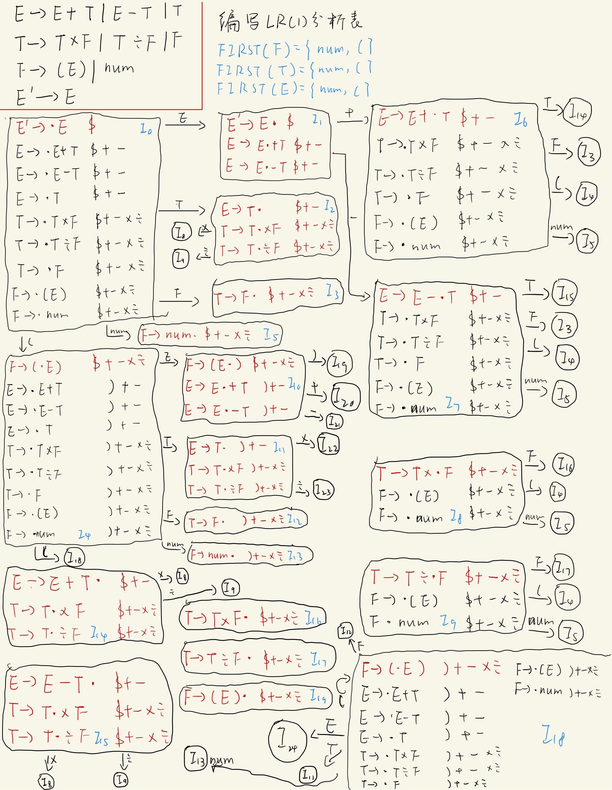
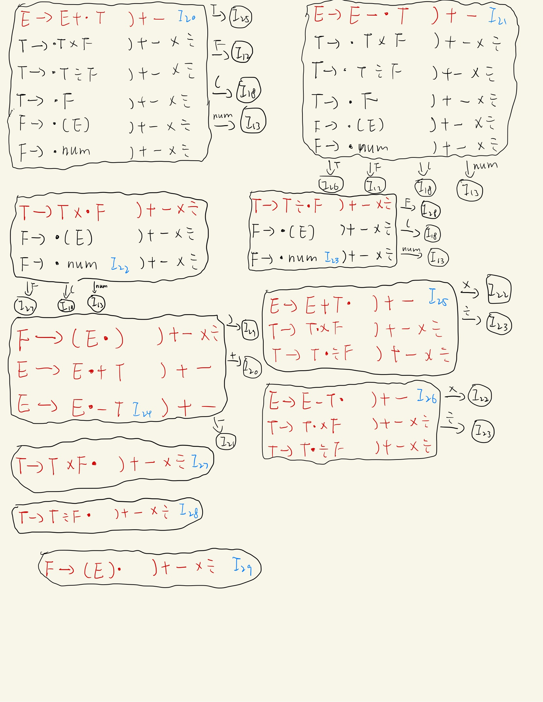

# 语法分析实验报告

## 实验环境

本次实现语法分析程序使用环境如下

- 操作系统:macOS Big Sur 11.6.8.

- c语言编译器:Apple clang version 13.0.0 (clang-1300.0.29.30).
- flex:flex 2.6.4 Apple(flex-34).
- bison:bison (GNU Bison) 2.3.

所有程序均在本机上运行通过。

---

## 实验任务

本次实验要求编写程序实现对算数表达式的语法分析，使用表达式文法如下

```c
E->E+T       
  |E-T       
  |T        
T->T*F       
  |T/F       
  |F         
F->(E)      
  |num       
```

要求在对算数表达式进行分析时依次输出所采用的产生式。

---

## 自顶向下的分析

### 递归下降

#### 代码实现思路

为了实现实用的(不带回溯)递归下降，需要采用预测分析方法。

为了知道选择哪一个产生式来进行分析，首先需要对原文发进行改造，需要提取左公因子并且消除左递归，原文法存在左递归，消除左递归后的文法如下

```c
E -> TE_
E_ -> +TE_
    | -TE_
    | epsilon
T -> FT_
T_ ->  *FT_
     | /FT_
     | epsilon
F -> (E)
    | NUM
```

有了改造后的文法容易依据文法写出递归下降程序，伪代码如下

```c
void E(){
  print "E->TE'"
  T()
  E_()
}

void E_(){
  if token == '+' then // 选择表达式 E_->+TE_
    print "E'->+TE'"
    get next token
    T()
  	E_()
   else if token == '-' then // 选择表达式 E_->-TE_
     print "E'->-TE'"
     get next token
     T()
  	 E_()
  else // 选择 E_->epsilon
    print "E'->epsilon" 
}

void T(){
  F()
  T_()
}

void T_(){
  if token == '*' then // 选择表达式 T_->*FT_
    print "T'->*FT_"
    get next token
    F()
  	T_()
   else if token == '-' then // 选择表达式 T_->/FT_
     print "T'->/FT_"
     get next token
     F()
  	 T_()
  else // 选择 T_->epsilon
    print "T'->epsilon" 
}

void F(){
  if token == '(' then
    print "F->(E)"
    get next token
    E()
    check if token == ')' , if not ,report an error,if token == ')' ,get next token
  else
    check if token == NUM
    if token == NUM ,get next token and print "F->num"
    if not ,report an error
}

int main(){
  get first token
  
  E()   // 进行语法分析
  
  return 0;
}
```

由上述伪代码可知，对每一个非终结符可以按照产生式来写对应的函数，每个函数分析处理一个非终结符，通过这种方法，可以很容易手动实现语法分析程序。

上面的伪代码可以进行语法分析并且输出用到的产生式，但我仍希望在对表达式分析完毕后可以同时计算出表达式的运算结果，为达到这个效果，修改代码如下

```c
int E(){  // 返回表达式求值结果
  int v = T();
  return E_(v);
}

int E_(int v){ // 由于表达式求值是左结合的，该函数需要知道表达式左边已有的计算结果，即参数v。返回表达式计算结果。
  if token == '+' then
    get next token
    v += T()
    return E_(v);
  else if token == '-' then
    get next token
    v -= T()
    return E_(v)
  else // 表达式计算结束了
    return v;
}

int T(){
  ...  // 返回一串只有* /的表达式计算结果 写法和E()类似
}

int T_(int v){
  ... // 和E_()写法类似
}

int F(){
  int v;
  if token == '(' then
    get next token
    v = E()
    check if token == ')' , if not ,report an error,if token == ')' ,get next token and return v
  else
    check if token == NUM
    if token == NUM ,get next token and return the number value
    if not ,report an error
}
```

通过边分析边依据token 来进行相应的计算，最终可以在完成分析后得到表达式的值。上述伪代码的具体实现见`recur_desc/main.c`文件。

---

#### 词法分析

上一小节的语法分析代码是以词法分析为基础的，为实现表达式语法解析至少应该要有一个能识别数字和字符并返回对应标记的词法分析器。为了简单考虑，我用`flex`实现了一个简单的词法分析器，主要代码如下(见`recur_desc/lex.l`文件)

```c
...

DIGIT [0-9]
WS    [ \t\r]
%%

{DIGIT}+    {start_pos = pos;pos += yyleng;yyval = strtol(yytext,NULL,0);return NUM;} // 识别整数并计算整数的值
{WS}  {pos += yyleng;}  // 跳过空白符
\n    {start_pos = pos;pos += yyleng;return END;}  // 程序以换行作为表达式结束标志
.   {start_pos = pos;pos += yyleng; yyval = yytext[0]; return yytext[0];} // 单个字符直接作为一个token
<<EOF>> {return EOF;}

...
```

上面代码中的`NUM`、`END`为自定义的宏，`start_pos`为每一个标记在一行中的位置(列数)，`pos`为当前词法分析器下一个输入字符所在位置(列数)，这两个变量用于在出现语法错误时定位错误位置。该词法分析器要配合头文件`lex.h`使用(见`recur_desc/lex.h`)，头文件内容如下

```c
#ifndef LR_LEX_H
#define LR_LEX_H

#define NUM 256
#define END 0

extern int yyval;

extern int start_pos;
extern int pos;

extern int yylex();


#endif //LR_LEX_H
```

使用`flex`产生`yy.lex.c`后主程序只需要使用`yylex`即可得到一个个标记。

---

#### 程序构建及测试

递归下降方法源程序详见`recur_desc`文件夹，文件夹结构如下

```bash
.
├── lex.h
├── lex.l
└── main.c
```

其中`main.c`为递归下降分析主程序，`lex.l`为`flex`输入文件，`lex.h`为词法分析相关头文件，构造可执行程序只需要在终端输入如下命令即可

```bash
flex lex.h     # 生成词法分析程序源码 lex.yy.c
gcc -o expr main.c lex.yy.c  # 生成可执行文件 expr
```

执行一些测试样例如下

```bash
>>1 + 2 + 3
E->TE'
T->FT'
F->NUM
T'->epsilon
E'->+TE'
T->FT'
F->NUM
T'->epsilon
E'->+TE'
T->FT'
F->NUM
T'->epsilon
E'->epsilon
= 6
```

可以看到正确输出了使用的产生式并计算出了正确结果，下面尝试使用一个较为复杂的表达式进行测试

```bash
>>3 * (3+ 9)*(1+(2+3)) - 27 / 3
E->TE'
T->FT'
F->NUM
T'->*FT'
F->(E)
E->TE'
T->FT'
F->NUM
T'->epsilon
E'->+TE'
T->FT'
F->NUM
T'->epsilon
E'->epsilon
T'->*FT'
F->(E)
E->TE'
T->FT'
F->NUM
T'->epsilon
E'->+TE'
T->FT'
F->(E)
E->TE'
T->FT'
F->NUM
T'->epsilon
E'->+TE'
T->FT'
F->NUM
T'->epsilon
E'->epsilon
T'->epsilon
E'->epsilon
T'->epsilon
E'->-TE'
T->FT'
F->NUM
T'->/FT'
F->NUM
T'->epsilon
E'->epsilon
= 207
```

可以看到最后计算结果正确无误。尝试几个带有语法错误的输入

```bash
>>1 + 2 +
E->TE'
T->FT'
F->NUM
T'->epsilon
E'->+TE'
T->FT'
F->NUM
T'->epsilon
E'->+TE'
T->FT'
8 : error: expect:NUM got:END
```

可以看到程序在检测到第八列(输入是1 + 2 +)出现了语法错误，换一个例子尝试

```bash
>>1 + (2 +4 * 5
E->TE'
T->FT'
F->NUM
T'->epsilon
E'->+TE'
T->FT'
F->(E)
E->TE'
T->FT'
F->NUM
T'->epsilon
E'->+TE'
T->FT'
F->NUM
T'->*FT'
F->NUM
T'->epsilon
E'->epsilon
14 : error: expect:) got:END
```

可以看到语法分析器在第14列报了一个错误，再换一个示例尝试

```bash
>>1 + 2 & （3 + 4）
E->TE'
T->FT'
F->NUM
T'->epsilon
E'->+TE'
T->FT'
F->NUM
T'->epsilon
E'->epsilon
7 :syntax error: an expression followed by illegal token
```

可以看到程序检测到第7列出现了一个错误。

---

### LL(1)语法分析程序

上面的语法分析程序采用了递归下降的方法，在本节中实现的程序不使用递归下降的方法，而是通过教材中的算法4.2构造预测分析表，并通过教材中的算法4.1使用构造好的预测分析表来分析输入的表达式。

首先第一步还是需要提取左公因子并消除左递归，处理后得到的文法产生式如下

```c
// E->TE'         0
// E'->+TE'       1
// E'->-TE'       2
// E'->epsilon    3
// T->FT'         4
// T'->*FT'       5
// T'->/FT'       6
// T'->epsilon    7
// F->(E)         8
// F->num         9
```

#### 数据结构定义

在我的程序实现中，各个非终结符和特殊的某些特殊符号也由一个数字标识，定义如下

```c
#define E 257
#define T 258
#define F 259
#define E_ 260
#define T_ 261

#define EPSILON 262  // 用于放入first集合中

#define END 0        // 用于放入follow集合中  可以理解成教材中的 $
```

产生式的结构定义如下

```c
typedef struct {
    int head;
    int body[MAX_BODY_SIZE];
    int size;
}production;

// head 为产生式头
// body为产生式体
// size 为产生式体的长度
// 空产生式的size为0
```

将表达式文法各产生式写入程序中如下

```c
production prods[] = {
        {.head = E,.body = {T,E_},.size = 2},
        {.head = E_,.body = {'+',T,E_},.size = 3},
        {.head = E_,.body = {'-',T,E_},.size = 3},
        {.head = E_,.body = {0},.size = 0},
        {.head = T,.body = {F,T_},.size = 2},
        {.head = T_,.body = {'*',F,T_},.size = 3},
        {.head = T_,.body = {'/',F,T_},.size = 3},
        {.head = T_,.body = {0},.size = 0},
        {.head = F,.body = {'(',E,')'},.size = 3},
        {.head = F,.body = {NUM},.size = 1},
};  // 按照前面给出的产生式书写该产生式数组
```

由于本次实验不要求程序自动求出各个非终结符的first集合和follow集合，但构造预测分析表时需要使用到这两个集合，故手动求出first和follow集合并写入程序源代码中，first和follow集合如下

```
first(E) = {'(',NUM}
first(T) = {'(',NUM}
first(F) = {'(',NUM}
first(E') = {'+','-',EPSILON}
first(T') = {'*','/',EPSILON}

follow(E) = {')', END}
follow(E') = {')', END}
follow(T)  = {'+','-',')',END}
follow(T') = {'+','-',')',END}
follow(F)  = {'+','-',')','*','/',END}
```

在程序中用如下几个数组来记录first和follow集合

```c
int first_size[] = {2,2,2,3,3};
// FIRST(E) is in first[E - 257]
// the size is first_size[E - 257]
int first[][100] = {
        {'(',NUM}, // FIRST(E)
        {'(',NUM}, // FIRST(T)
        {'(',NUM}, // FIRST(F)
        {'+','-',EPSILON}, // FIRST(E')
        {'*','/',EPSILON}, // FIRST(T')
};

// similar to first
int follow_size[] = {2,4,6,2,4};
int follow[][100] = {
        {')',END}, // FOLLOW(E)
        {'+','-',')',END}, // FOLLOW(T)
        {'+','-',')','*','/',END}, // FOLLOW(F)
        {')',END}, // FOLLOW(E')
        {'+','-',')',END}, // FOLLOW(T')
};
```

---

#### 求文法符号串的first算法

在自动构造预测分析表时，需要计算各个产生式右侧的文法符号串的first集合，故需要设计算法来计算first集合，该算法描述伪代码如下

```c
FIRST(alpha){
  result = an empty set
  bool has_epsilon = false;
  if size(alpha) == 0 then  // 文法符号串长度为0
    return {EPSILON}
  
  i = 0
  do{
    if alpha[i] is terminal symbol then
      add alpha[i] to result
    else // alpha[i] is non-terminal symbol
      for all a in first(alpha)
        if a is EPSILON THEN
          has_epsilon = true
        else
        	add a to result
    i ++
  }while(has_epsilon and i < size(alpha))
    
  if has_epsilon then
    add EPSILON to result
  return result
}
```

上述伪代码思路为：从文法符号串最左边的文法符号开始，若该符号为终结符，将终结符加入结果集中；若该符号为非终结符，将该非终结符的first集合中的各个终结符放入结果集中，若该first集合内有EPSILON，则继续用同样的方法检查下一个文法符号。检查完所有的文法符号，若最后一个文法符号是非终结符且其first集合中也存在EPSILON则将EPSILON加入结果集中。具体的实现见`LL/parse.c`中的`FIRST`函数。

#### 自动构造预测分析表

预测分析表在程序中表示为一个二维数组，定义如下

```c
#define TABLE_SIZE 1000

int table[TABLE_SIZE][TABLE_SIZE]; // 预测分析表
// 第一个下标为非终结符数字标号
// 第二个下标为终结符数字标号
// 数组中的元素为产生式编号
// 产生式编号见  LL(1)语法分析程序  这一小节的开头，编号也就是prods数组的下标
```

有了预测分析表的定义，可以依据教材中的算法4.2自动构造预测分析表，算法伪代码如下

```c
void construct_table(){
  for all valid (i,j)
    table[i][j] = -1  // -1 means error
  
  for (i=0;i < number of productions; i++) {
    first = FIRST(prods[i])
    for each terminal symbol a in first 
      table[prods[i].head][a] = i
    
    if EPSILON in first {
      follow = FOLLOW(prods[i].head)
      for each a in follow
        table[prods[i].head][a] = i
    }
  }
}
```

具体实现详见文件`LL/parse.c`内的`construct_table`函数。

---

#### 语法分析

构造完预测分析表后，可以根据表来对输入进行语法分析，语法分析程序伪代码如下

```c
#define STACK_SIZE 1024

int stack[STACK_SIZE] = {END, E};
int top = 1;

int parse(){
  int X;
  while(top >= 0){ // 栈非空
    X = stack[top];
    if X is terminal symbol
      if X == token
        top --
        get next token
      else
        report an error and return -1
    else // X is non-terminal symbol
      if table[X][token] == -1
        report an error and return -1
      top --
      get production A->X1X2...Xn from table[X][token]
     	put Xn ... X2 X1 in the stack
  }
  
  return 0  // parse successfully
}
```

具体实现详见文件`LL/parse.c`中的`parse`函数。

---

#### 词法分析

和递归下降相同，该程序实现时使用flex生成词法分析器，flex输入文件与递归下降的输入文件类似，不再详述，详见`LL/lex.l`。

#### 程序构建及测试

该程序源代码见`LL`文件夹，文件夹下内容为

```bash
.
├── CMakeLists.txt
├── lex.h
├── lex.l
├── main.c
├── parser.c
└── parser.h
```

其中`parser.c`中构建预测分析表并分析输入，`lex.l`为`flex`输入文件，`lex.h`为和词法分析相关的头文件，`parser.h`为`parser.c`的头文件，`CMakeLists.txt`为`cmake`构建程序需要的文件(由于使用clion所以用了cmake，也可以直接使用gcc编译).

在LL目录下，首先使用`flex`生成词法分析器

```bash
flex lex.l  # 生成lex.yy.c
```

使用cmake生成可执行文件

```bash
mkdir build  # 构建文件夹
cd build
cmake ..     # 产生构建相关的文件
make         # 产生可执行文件
```

或者直接使用如下命令生成可执行文件

```bash
gcc -o LL lex.yy.c parser.c main.c
```

该程序使用文件作为输入，文件中只有一行表达式，文件名通过第一个命令行参数来指定，为了测试程序结果，新建一个文件`expression.txt`，尝试一个简单的样例如下

```
1 + 2 + 3
```

程序运行结果为，程序每次会输出在第几列碰到了什么token，若栈顶是终结符，输出弹出栈顶终结符后栈的状态，若栈顶是非终结符，输出使用的产生式即运用产生式体替换栈顶非终结符后栈的状态。

```bash
./LL expression.txt
***************************
at column 1:got: NUM ,use E->TE'
END E' T 
------------------------------
at column 1:got: NUM ,use T->FT'
END E' T' F 
------------------------------
at column 1:got: NUM ,use F->NUM
END E' T' NUM 
------------------------------
at column 1:got: NUM 
END E' T' 
------------------------------
at column 3:got: + ,use T'->epsilon
END E' 
------------------------------
at column 3:got: + ,use E'->+TE'
END E' T + 
------------------------------
at column 3:got: + 
END E' T 
------------------------------
at column 5:got: NUM ,use T->FT'
END E' T' F 
------------------------------
at column 5:got: NUM ,use F->NUM
END E' T' NUM 
------------------------------
at column 5:got: NUM 
END E' T' 
------------------------------
at column 7:got: + ,use T'->epsilon
END E' 
------------------------------
at column 7:got: + ,use E'->+TE'
END E' T + 
------------------------------
at column 7:got: + 
END E' T 
------------------------------
at column 9:got: NUM ,use T->FT'
END E' T' F 
------------------------------
at column 9:got: NUM ,use F->NUM
END E' T' NUM 
------------------------------
at column 9:got: NUM 
END E' T' 
------------------------------
at column 9:got: END ,use T'->epsilon
END E' 
------------------------------
at column 9:got: END ,use E'->epsilon
END 
------------------------------
at column 9:got: END 

------------------------------
the input is an expression
```

接着尝试一个较复杂的例子，修改`expression.txt`如下

```
1 + 2 * 3 - 3 * (2 + 3) - 9 / 3
```

运行结果如下

```bash
./LL expression.txt
***************************
at column 1:got: NUM ,use E->TE'
END E' T 
------------------------------
at column 1:got: NUM ,use T->FT'
END E' T' F 
------------------------------
at column 1:got: NUM ,use F->NUM
END E' T' NUM 
------------------------------
at column 1:got: NUM 
END E' T' 
------------------------------
at column 3:got: + ,use T'->epsilon
END E' 
------------------------------
at column 3:got: + ,use E'->+TE'
END E' T + 
------------------------------
at column 3:got: + 
END E' T 
------------------------------
at column 5:got: NUM ,use T->FT'
END E' T' F 
------------------------------
at column 5:got: NUM ,use F->NUM
END E' T' NUM 
------------------------------
at column 5:got: NUM 
END E' T' 
------------------------------
at column 7:got: * ,use T'->*FT'
END E' T' F * 
------------------------------
at column 7:got: * 
END E' T' F 
------------------------------
at column 9:got: NUM ,use F->NUM
END E' T' NUM 
------------------------------
at column 9:got: NUM 
END E' T' 
------------------------------
at column 11:got: - ,use T'->epsilon
END E' 
------------------------------
at column 11:got: - ,use E'->-TE'
END E' T - 
------------------------------
at column 11:got: - 
END E' T 
------------------------------
at column 13:got: NUM ,use T->FT'
END E' T' F 
------------------------------
at column 13:got: NUM ,use F->NUM
END E' T' NUM 
------------------------------
at column 13:got: NUM 
END E' T' 
------------------------------
at column 15:got: * ,use T'->*FT'
END E' T' F * 
------------------------------
at column 15:got: * 
END E' T' F 
------------------------------
at column 17:got: ( ,use F->(E)
END E' T' ) E ( 
------------------------------
at column 17:got: ( 
END E' T' ) E 
------------------------------
at column 18:got: NUM ,use E->TE'
END E' T' ) E' T 
------------------------------
at column 18:got: NUM ,use T->FT'
END E' T' ) E' T' F 
------------------------------
at column 18:got: NUM ,use F->NUM
END E' T' ) E' T' NUM 
------------------------------
at column 18:got: NUM 
END E' T' ) E' T' 
------------------------------
at column 20:got: + ,use T'->epsilon
END E' T' ) E' 
------------------------------
at column 20:got: + ,use E'->+TE'
END E' T' ) E' T + 
------------------------------
at column 20:got: + 
END E' T' ) E' T 
------------------------------
at column 22:got: NUM ,use T->FT'
END E' T' ) E' T' F 
------------------------------
at column 22:got: NUM ,use F->NUM
END E' T' ) E' T' NUM 
------------------------------
at column 22:got: NUM 
END E' T' ) E' T' 
------------------------------
at column 23:got: ) ,use T'->epsilon
END E' T' ) E' 
------------------------------
at column 23:got: ) ,use E'->epsilon
END E' T' ) 
------------------------------
at column 23:got: ) 
END E' T' 
------------------------------
at column 25:got: - ,use T'->epsilon
END E' 
------------------------------
at column 25:got: - ,use E'->-TE'
END E' T - 
------------------------------
at column 25:got: - 
END E' T 
------------------------------
at column 27:got: NUM ,use T->FT'
END E' T' F 
------------------------------
at column 27:got: NUM ,use F->NUM
END E' T' NUM 
------------------------------
at column 27:got: NUM 
END E' T' 
------------------------------
at column 29:got: / ,use T'->/FT'
END E' T' F / 
------------------------------
at column 29:got: / 
END E' T' F 
------------------------------
at column 31:got: NUM ,use F->NUM
END E' T' NUM 
------------------------------
at column 31:got: NUM 
END E' T' 
------------------------------
at column 31:got: END ,use T'->epsilon
END E' 
------------------------------
at column 31:got: END ,use E'->epsilon
END 
------------------------------
at column 31:got: END 

------------------------------
the input is an expression
```

以上输出经过和递归下降程序对比发现能正确输出使用的产生式。

尝试输入错误的表达式，修改样例为`1 + ) 8`，程序输出如下

```bash
./LL expression.txt
***************************
at column 1:got: NUM ,use E->TE'
END E' T 
------------------------------
at column 1:got: NUM ,use T->FT'
END E' T' F 
------------------------------
at column 1:got: NUM ,use F->NUM
END E' T' NUM 
------------------------------
at column 1:got: NUM 
END E' T' 
------------------------------
at column 3:got: + ,use T'->epsilon
END E' 
------------------------------
at column 3:got: + ,use E'->+TE'
END E' T + 
------------------------------
at column 3:got: + 
END E' T 
------------------------------
current non-terminal symbol is T
got: ) at column 5,have no item in prediction table
```

可以看到在分析到第5列时，栈顶为T，当前输入符号为 ) ，在预测分析表无法查到对应表项。

再尝试修改样例为`(3 + 2 &)-3`，输出结果如下

```bash
./LL expression.txt
***************************
at column 1:got: ( ,use E->TE'
END E' T 
------------------------------
at column 1:got: ( ,use T->FT'
END E' T' F 
------------------------------
at column 1:got: ( ,use F->(E)
END E' T' ) E ( 
------------------------------
at column 1:got: ( 
END E' T' ) E 
------------------------------
at column 2:got: NUM ,use E->TE'
END E' T' ) E' T 
------------------------------
at column 2:got: NUM ,use T->FT'
END E' T' ) E' T' F 
------------------------------
at column 2:got: NUM ,use F->NUM
END E' T' ) E' T' NUM 
------------------------------
at column 2:got: NUM 
END E' T' ) E' T' 
------------------------------
at column 4:got: + ,use T'->epsilon
END E' T' ) E' 
------------------------------
at column 4:got: + ,use E'->+TE'
END E' T' ) E' T + 
------------------------------
at column 4:got: + 
END E' T' ) E' T 
------------------------------
at column 6:got: NUM ,use T->FT'
END E' T' ) E' T' F 
------------------------------
at column 6:got: NUM ,use F->NUM
END E' T' ) E' T' NUM 
------------------------------
at column 6:got: NUM 
END E' T' ) E' T' 
------------------------------
current non-terminal symbol is T'
got: & at column 8,have no item in prediction table
```

---

### LR(1)语法分析程序

使用LR(1)自底向上分析，首先需要给产生式编号，在程序中使用如下产生式，编号见产生式右边

```c
//E->E+T       0
//E->E-T       1
//E->T         2
//T->T*F       3
//T->T/F       4
//T->F         5
//F->(E)       6
//F->num       7
```

#### 手动构造action表

由于本次实验不要去自动产生action表，因此采用手动构造action表并写入程序的方法来完成本次实验。首先画出状态转移图如下





根据状态转移图写出action表如下

|      | (    | )    | +    | -    | *    | /    | num  | E    | T    | F    | $    |
| ---- | ---- | ---- | ---- | ---- | ---- | ---- | ---- | ---- | ---- | ---- | ---- |
| 0    | S4   |      |      |      |      |      | S5   | 1    | 2    | 3    |      |
| 1    |      |      | S6   | S7   |      |      |      |      |      |      | Acc  |
| 2    |      |      | R2   | R2   | S8   | S9   |      |      |      |      | R2   |
| 3    |      |      | R5   | R5   | R5   | R5   |      |      |      |      | R5   |
| 4    | S18  |      |      |      |      |      | S13  | 10   | 11   | 12   |      |
| 5    |      |      | R7   | R7   | R7   | R7   |      |      |      |      | R7   |
| 6    | S4   |      |      |      |      |      | S5   |      | 14   | 3    |      |
| 7    | S4   |      |      |      |      |      | S5   |      | 15   | 3    |      |
| 8    | S4   |      |      |      |      |      | S5   |      |      | 16   |      |
| 9    | S4   |      |      |      |      |      | S5   |      |      | 17   |      |
| 10   |      | S19  | S20  | S21  |      |      |      |      |      |      |      |
| 11   |      | R2   | R2   | R2   | S22  | S23  |      |      |      |      |      |
| 12   |      | R5   | R5   | R5   | R5   | R5   |      |      |      |      |      |
| 13   |      | R7   | R7   | R7   | R7   | R7   |      |      |      |      |      |
| 14   |      |      | R0   | R0   | S8   | S9   |      |      |      |      | R0   |
| 15   |      |      | R1   | R1   | S8   | S9   |      |      |      |      | R1   |
| 16   |      |      | R3   | R3   | R3   | R3   |      |      |      |      | R3   |
| 17   |      |      | R4   | R4   | R4   | R4   |      |      |      |      | R4   |
| 18   | S18  |      |      |      |      |      | S13  | 24   | 11   | 12   |      |
| 19   |      |      | R6   | R6   | R6   | R6   |      |      |      |      | R6   |
| 20   | S18  |      |      |      |      |      | S13  |      | 25   | 12   |      |
| 21   | S18  |      |      |      |      |      | S13  |      | 26   | 12   |      |
| 22   | S18  |      |      |      |      |      | S13  |      |      | 27   |      |
| 23   | S18  |      |      |      |      |      | S13  |      |      | 28   |      |
| 24   |      | S29  | S20  | S21  |      |      |      |      |      |      |      |
| 25   |      | R0   | R0   | R0   | S22  | S23  |      |      |      |      |      |
| 26   |      | R1   | R1   | R1   | S22  | S23  |      |      |      |      |      |
| 27   |      | R3   | R3   | R3   | R3   | R3   |      |      |      |      |      |
| 28   |      | R4   | R4   | R4   | R4   | R4   |      |      |      |      |      |
| 29   |      | R6   | R6   | R6   | R6   | R6   |      |      |      |      |      |

---

#### 相关数据结构定义

LR(1)分析程序和LL(1)分析中的产生式数据结构定义一致，均采用`production`结构体来表示一个产生式，所有产生式写入程序中如下

```c
#define E 257
#define T 258
#define F 259

production prods[] = {
        {.head=E,.body={E,'+',T},.size=3},
        {.head=E,.body={E,'-',T},.size=3},
        {.head=E,.body={T},.size=1},
        {.head=T,.body={T,'*',F},.size=3},
        {.head=T,.body={T,'/',F},.size=3},
        {.head=T,.body={F},.size=1},
        {.head=F,.body={'(',E,')'},.size=3},
        {.head=F,.body={NUM},.size=1},
};
```

action表中每一项代表一个动作，动作可能有移入、规约、GOTO、ACC或出错这几种，定义action结构体如下

```c
#define SHIFT 0
#define REDUCE 1
#define GOTO 2
#define ACC 3
#define ERROR 4

typedef struct {
    int type;  
    int num;   
}action;
```

如上所示，结构体中的字段type为SHIFT时表示该动作为移入，num字段标识移入的状态编号;type为REDUCE时表示该动作为规约，num为规约使用的产生式编号，各产生式编号见前文(就是prods数组的下标)；type为GOTO时num为要压入栈的状态编号；type为ACC表示语法分析成功；type为ERROR表示出错。

有了action结构体的定义，可以定义action表如下

```c
action action_table[30][300];
// action_table[state_number][symbol]中存着对应的动作
// state_number为状态编号，一共30个状态，编号0-29
// symbol为文法符号(包括终结符和非终结符)的编号
```

有了action表，为了完成